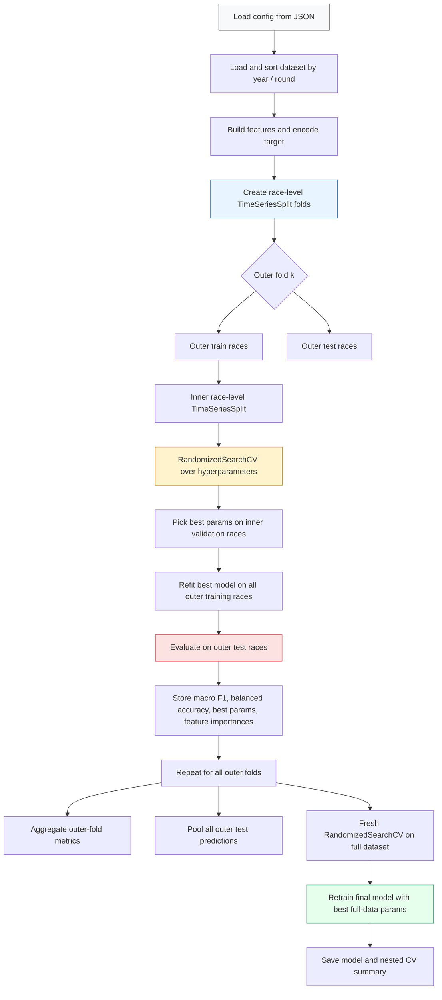

# Random Forest Nested CV Flow

## Reading guide

- The **outer loop** estimates performance on future races.
- The **inner loop** chooses hyperparameters using only the outer training races.
- The final model is selected with a fresh search on all data after nested CV finishes.
